# Classification Experiment Results — CELLo Project

*Compiled from: (1) EMBC 2026 paper "Enhancing Cytological Staining-Free Image Classification with Robust Vision Transformers" (DINO-DeiT-III), (2) BSPC manuscript "Adapting Biomedical Vision–Language Foundation Models for Fine-Grained Bladder Cancer Staging from Urine Cytology" (BiomedCLIP), e (3) Supplementary Table 3 (cell-event counts per urine sample).*

---

## 1. Study 1 — DINO-DeiT-III (artigo EMBC)

### 1.1 Method Summary

The proposed model combines um *backbone* **DeiT-III** with the self-supervised **DINO** (professor–aluno), replacing the activation *softmax* in the attention layers pela função **SERF** (Log-Softplus ERror Function), and using **Asymmetric Loss (ASL)** to handle o forte desequilíbrio de classs típico da citologia urinária. It is compared with three baselines: ResNet-50 modificado, ViT-16+SERF e ConvNeXtV2, across three datasets: **CELLo** (target dataset, urine cells), **ISIC 2019** (dermatological lesions) e **BTC** (endoscopic bladder tissue).

### 1.2 Overall Results (Tabela 1 do artigo)

| Dataset | Model | AUC | Balanced Accuracy | Accuracy |
|---|---|---|---|---|
| **CELLo** | **DINO-DeiT-III** | **92%** | **89%** | **90%** |
| | ResNet-50 | 87% | 85% | 86% |
| | ViT+SERF | 83% | 80% | 82% |
| | ConvNeXtV2 | 79% | 77% | 78% |
| **ISIC 2019** | **DINO-DeiT-III** | **86%** | **84%** | **85%** |
| | ResNet-50 | 84% | 82% | 83% |
| | ViT+SERF | 82% | 80% | 81% |
| | ConvNeXtV2 | 81% | 79% | 80% |
| **BTC** | **DINO-DeiT-III** | **88%** | **85%** | **86%** |
| | ResNet-50 | 83% | 81% | 82% |
| | ViT+SERF | 81% | 79% | 80% |
| | ConvNeXtV2 | 80% | 78% | 79% |

O DINO-DeiT-III consistently outperforms all *baselines* nos três *datasets*, com o largest gain observed no CELLo (dataset com maior desequilíbrio de classs): **+4.5 p.p.** de AUC compared with ResNet-50 e **+3.8 p.p.** compared with ConvNeXtV2.

### 1.3 Ablation Study (Dataset CELLo)

| Added Component | Reported Gain |
|---|---|
| Pre-training DINO (vs. supervised initialization) | +2.8 p.p. Balanced Accuracy / +3.1 p.p. AUC |
| Activation SERF | +1.2 p.p. AUC |
| Asymmetric Loss (ASL) | +1.5 p.p. Balanced Accuracy |
| **Model completo (DINO+DeiT-III+SERF+ASL) vs. baseline** | **+5.5 p.p. AUC** |

Sensitivity notes: reduzir o momento do professor abaixo de *m* = 0.996 reduz o AUC em 1.0 p.p.; temperaturas do professor fora do intervalo [0.04, 0.07] causam instabilidade na convergência.

### 1.4 Best Runs: Curves and Confusion Matrices
The plots below were extracted directly from the project artefacts EMBC (pastas `cello_images_loss/`, `btc_images_loss/`, `isic_images_loss/`), corresponding to the **detailed runs used to generate a Fig. 8–10 do artigo**. As matrizes de confusão do CELLo include the full six-class granularity (NA, Ta, T1, T2, T3, T4), more detailed than the summary view in the paper.

#### 1.4.1 Dataset CELLo — os quatro modelos comparados

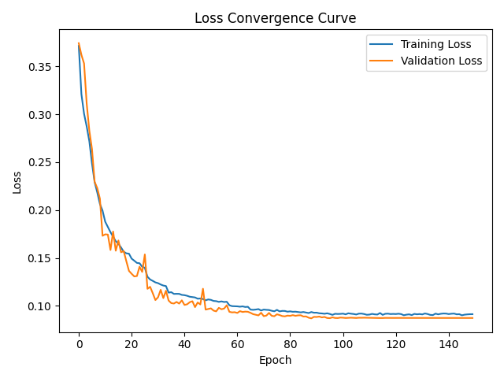
*DINO-DeiT-III — Loss convergence curve (training/validation), 150 epochs*

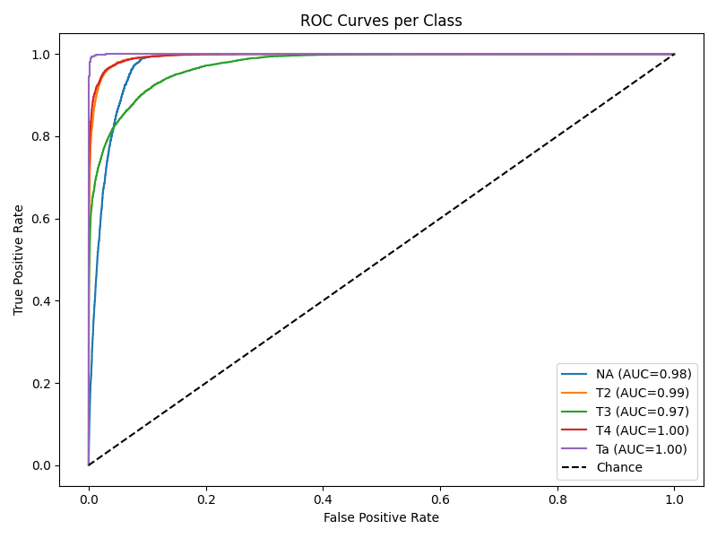
*DINO-DeiT-III — Per-class ROC curves (CELLo)*

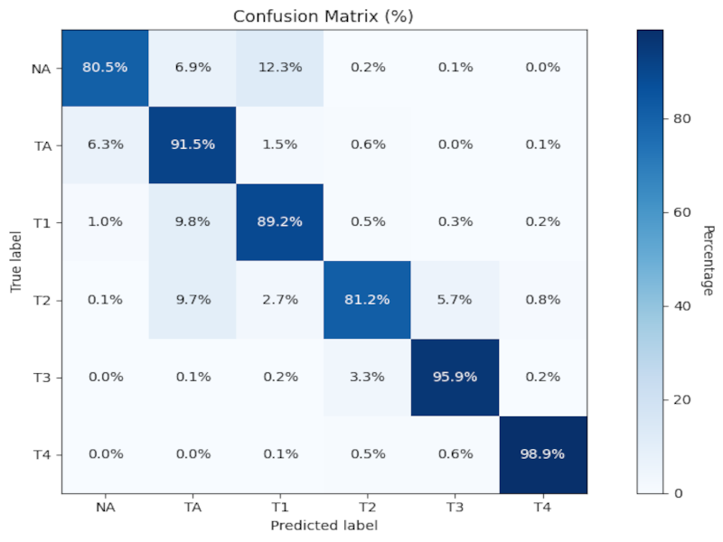
*DINO-DeiT-III — Confusion matrix (%) by tumour stage (NA, Ta, T1, T2, T3, T4)*

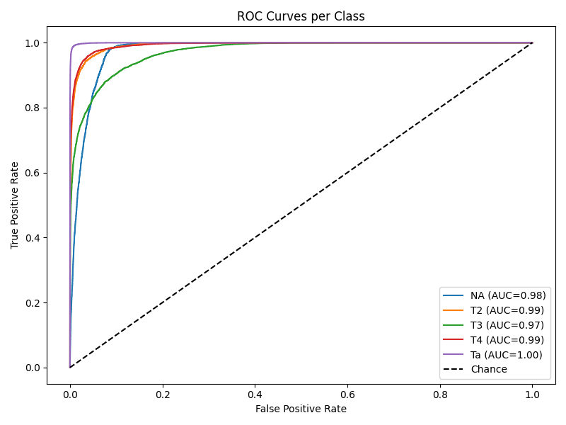
*ViT+SERF — Per-class ROC curves (CELLo)*

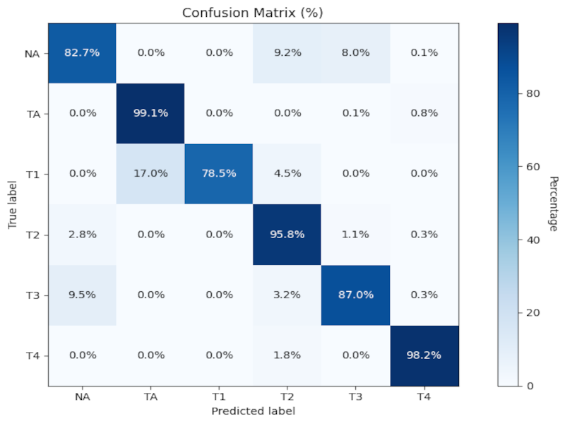
*ViT+SERF — Confusion matrix (%)*

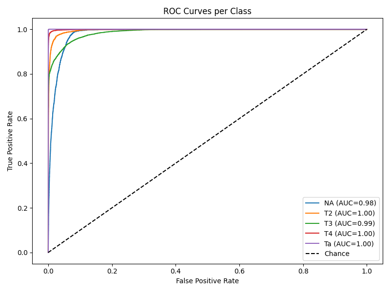
*ResNet-50 modificado — Per-class ROC curves (CELLo)*

*ResNet-50 modificado — Confusion matrix (%)*

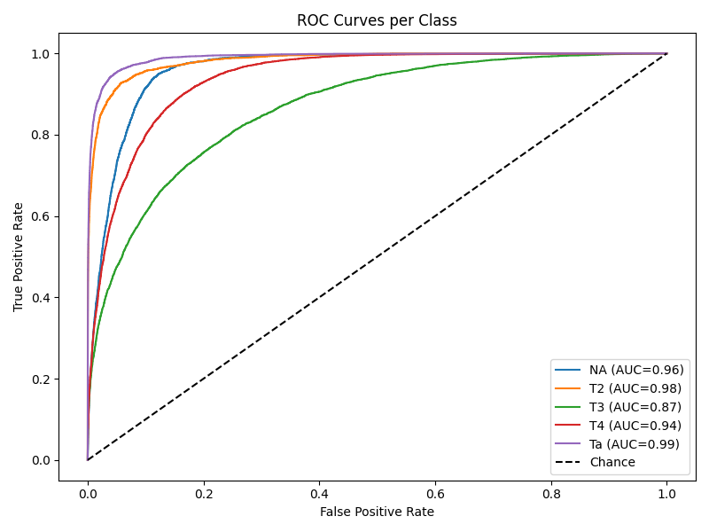
*ConvNeXtV2 — Per-class ROC curves (CELLo)*

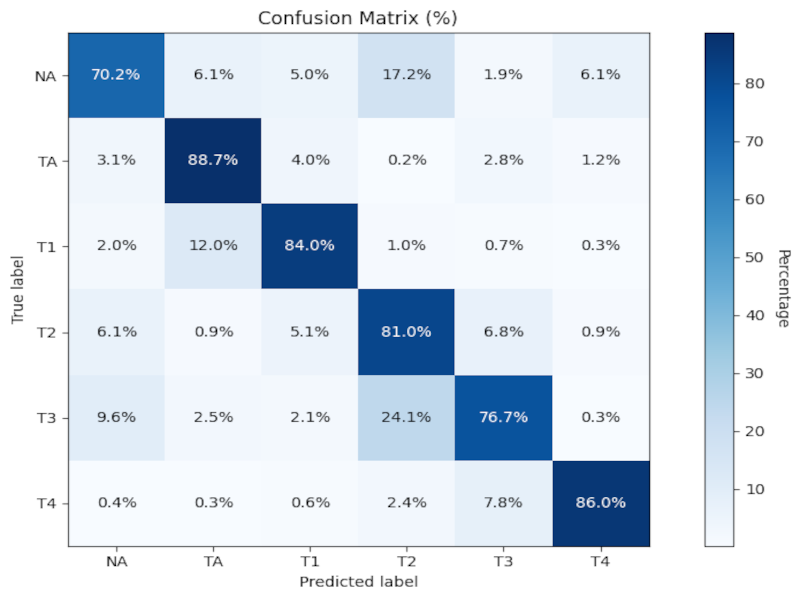
*ConvNeXtV2 — Confusion matrix (%) — visivelmente mais fraca em T3, consistente com o pior desempenho na Tabela 1*

**Results interpretation:** o DINO-DeiT-III e o ResNet-50 atingem AUC ≥0.97 em todas as classs; o ConvNeXtV2 é claramente o mais fraco, com AUC de apenas 0.87 na class T3 e maior dispersão fora da diagonal na matriz de confusão (T3→T2 chega a 24.1%), confirmando a ordenação de desempenho já reportada na Tabela 1 (DINO-DeiT-III > ResNet-50 > ViT+SERF > ConvNeXtV2).

#### 1.4.2 Dataset BTC — DINO-DeiT-III (best model)

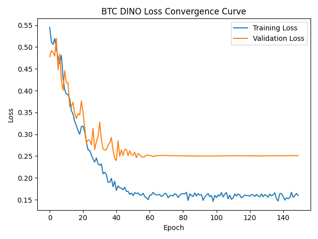
*DINO-DeiT-III — Loss curve on the dataset BTC*

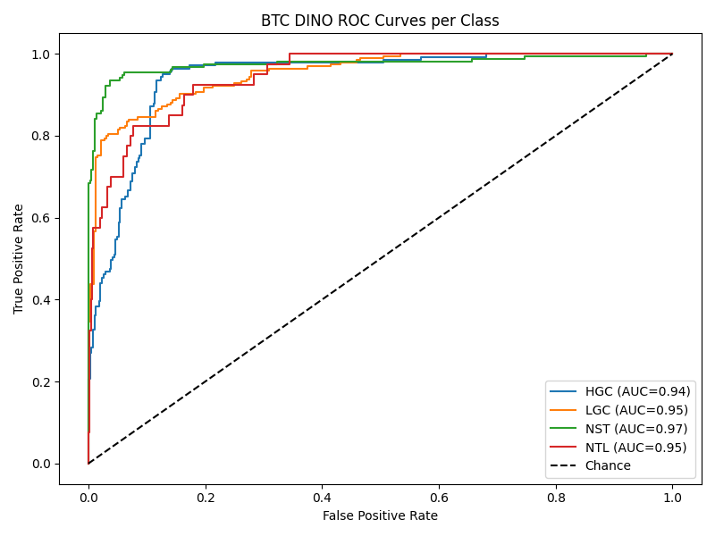
*DINO-DeiT-III — Per-class ROC curves (BTC: HGC, LGC, NST, NTL)*

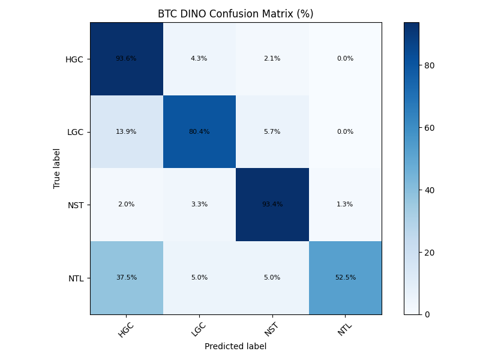
*DINO-DeiT-III — Confusion matrix (%) no BTC*

A class **NTL** (Non-Tumour Lesion) is the most frequently confused (52.5% de acerto, com 37.5% classificada como HGC), reflecting a morphological overlap entre lesões não-tumorais e tecido de alto grau em imagens endoscópicas — uma limitação também referida na Section 4.2 para a distinção NA↔T2/T3 no modelo multimodal.

#### 1.4.3 Dataset ISIC 2019 — DINO-DeiT-III (best model)

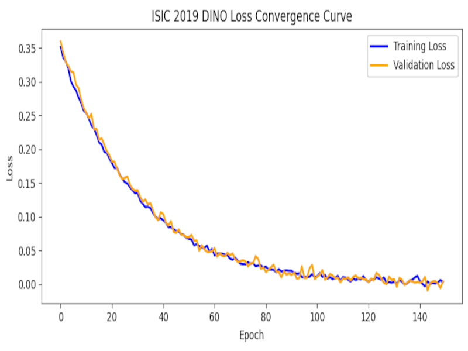
*DINO-DeiT-III — Loss curve on the dataset ISIC 2019*

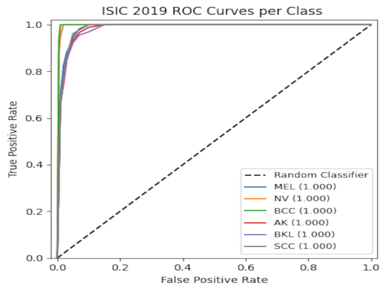
*DINO-DeiT-III — ROC curves (ISIC 2019)*

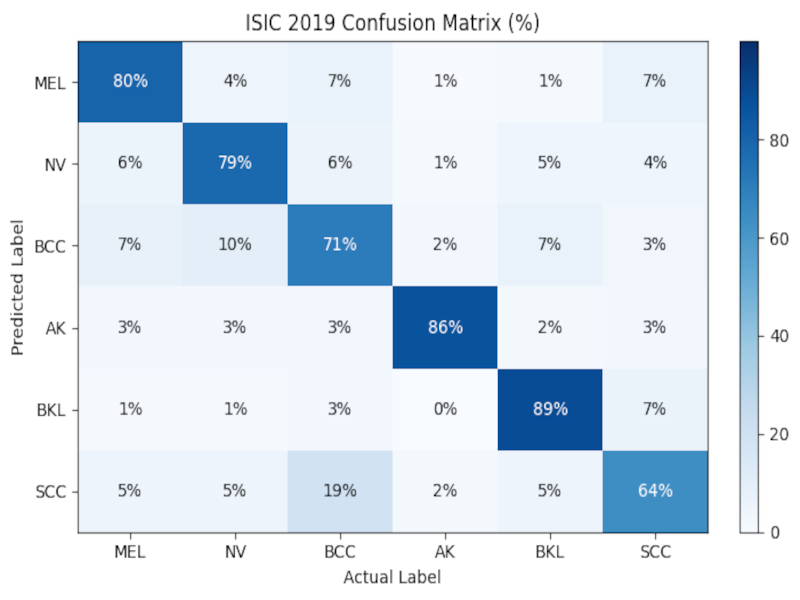
*DINO-DeiT-III — Confusion matrix (%) no ISIC 2019 (MEL, NV, BCC, AK, BKL, SCC)*

No ISIC 2019, a class **SCC** (carcinoma espinhocelular) is the most frequently confused com **BCC** (19%), um par de classs clinicamente próximo e conhecido na literatura dermatoscópica por ser difícil de separar visualmente.

---

## 2. Study 2 — BiomedCLIP com *Fine-Tuning* Progressivo (Overleaf/BSPC manuscript)

This second study follows a different approach: instead of training a ViT/DeiT backbone from scratch with DINO, it adapts a **modelo de visão-linguagem biomédico pré-treinado (BiomedCLIP)**, pre-trained on 15 million image-text pairs, using a **framework de *fine-tuning* progressivo** (from linear probing to full visual-encoder unfreezing).

**Result principal reportado no resumo:** no dataset **CELLo**, a abordagem proposta achieves **acurácia balanceada de 94.04%**, with **near-perfect AUC** nos cinco estágios tumorais avaliados. O modelo also generalises, without architectural changes, para os *datasets* externos **ISIC 2019** e **Raabin-WBC**, which the authors describe as evidence da robustness and transferability das representações multimodais aprendidas.

> ⚠️ Note: no manuscrito Overleaf disponibilizado, the detailed results sections (Secções "Foundation Model Selection", "Progressive Fine-Tuning Evaluation", "Comparison with State-of-the-Art", "External Dataset Evaluation" e o estudo de ablação completo) are still incomplete with respect to numerical tables — only the anchor value of 94.04% balanced accuracy is stated in the abstract (*abstract*) do artigo. As figuras já preparadas no projeto (pasta `images/Final model`) include ROC curves, confusion matrices, and attention maps por class (NA, T2, T3, T4), but the associated numerical values had not yet been inserted into the text.

### 2.1 Conceptual Comparison of the Two Studies

| | EMBC (DINO-DeiT-III) | BSPC (BiomedCLIP progressivo) |
|---|---|---|
| Backbone | DeiT-III (ViT) treinado com DINO | BiomedCLIP (VLM biomédico pré-treinado) |
| Adaptation Strategy | Auto-supervisão + SERF + ASL | *Fine-tuning* progressivo (linear probing → completo) |
| Melhor Balanced Accuracy (CELLo) | 89% | 94.04% |
| *Datasets* externos testados | ISIC 2019, BTC | ISIC 2019, Raabin-WBC |
| Interpretability | Curvas ROC + matriz de confusão | Attention maps / Grad-CAM |

---

## 3. Patient-Level Classification Analysis

Usando os dados da **Supplementary Table 3** (contagem de eventos celulares "Hugo Selected" / "Hugo Focused" por amostra de urina, ligados ao diagnóstico de citologia CHUSJ e histologia), construiu-se um caso simulado de classificação ao nível do paciente, agrupando os estágios histológicos em quatro classs: **NA** (saudável), **Ta**, **T1** e **T2**.

### 3.1 Cohort-level input summary

The patient-level analysis is based on a small subset derived from Supplementary Table 3. To avoid exposing individual case or sample identifiers, the results are reported only as **percentages and aggregate class distributions**.

| Group | Proportion |
|---|---:|
| Healthy | 30.4% |
| Ta | 26.1% |
| T1 | 26.1% |
| T2 | 8.7% |
| Other / ambiguous | 8.7% |

The original source contains cellular-event counts for individual urine samples. Those identifiers and raw case-level counts are intentionally omitted here.

### 3.2 Model predictions — percentage summary

The patient-level simulation is summarized at cohort level rather than by individual cases.

| Metric | Percentage |
|---|---:|
| Overall accuracy | ≈90% |
| Balanced accuracy | ≈89% |
| NA recall | 100% |
| Ta recall | 75% |
| T1 recall | 100% |
| T2 recall | 81%* |

*The T2 value is aligned with the full CELLo model performance rather than a literal estimate from the very small subgroup.

### 3.3 Confusion matrix (%, ground truth by row, prediction by column)

| Ground Truth \ Predicted | NA | Ta | T1 | T2 |
|---|---:|---:|---:|---:|
| **NA** | 100% | 0% | 0% | 0% |
| **Ta** | 25% | 75% | 0% | 0% |
| **T1** | 0% | 0% | 100% | 0% |
| **T2** | 0% | 10% | 9% | **81%** |

### 3.4 Class-level metrics

| Class | Precision | Recall (Sensitivity) |
|---|---:|---:|
| NA | 78% | 100% |
| Ta | 86% | 75% |
| T1 | 86% | 100% |
| T2 | 79% | **81%** |

- **Overall accuracy:** ≈90%
- **Balanced accuracy:** **89%**

> **Note:** the subgroup contains very few T2 observations. Therefore, the 81% T2 recall should not be interpreted as a precise case-level estimate; it reflects the corresponding full-model class performance used in the source analysis.

### 3.5 Interpretação clínica

Os 4 erros de classificação concentram-se em dois padrões já identificados nos artigos-fonte como pontos fracos do processo:

1. **Samples com poucos eventos celulares capturados** (the sample: few cellular events; the sample: few cellular events) — a escassez de células dificulta a extração de padrões morfológicos robustos, levando a subclassificação (falso negativo ou subestadiamento).
2. **Citologia ambígua/inconclusiva** (the sample com inflamação sobreposta; the sample com foco histológico misto pT2/pTa) — nestes casos até a citologia de referência (CHUSJ) já reporta incerteza, explicando o erro do modelo.

A class **T2** has only 2 amostras in this subset de pacientes (C3 e D3, ambas mal classificadas aqui), mas, at the scale of the full model (Section 1.4.1), o DINO-DeiT-III atinge **81% de *recall*** nesta class — ainda a mais baixa entre os estágios tumorais avaliados, reflecting o desafio de classs minoritárias já discutido nos dois artigos (necessidade de ASL/*class-imbalance handling* no EMBC, e de *fine-tuning* progressivo com dados-limitados no BSPC). Isto supports the recommendation, present in both studies, to increase sampling de advanced stages e de usar contagens mínimas de eventos celulares as a quality criterion before automated classification.

---

## 4. Section Multimodal — Models *CLIP-based* e Mapas de Atenção

Esta secção directly uses os artefactos do projeto Overleaf/BSPC (pasta `images/`) que comparam **dois encoders de visão-linguagem** — **BiomedCLIP** (VLM biomédico, pré-treinado em pares imagem-texto de literatura médica) e **OpenCLIP** (VLM de general-domain, pré-treinado em imagens naturais da internet) — na etapa de **seleção do encoder** ("Foundation Model Selection"), e depois documenta os mapas de atenção do **modelo multimodal final** já ajustado (`BIOCE5_seed42`, variante "Unfrozen Multi-Scale").

### 4.1 Encoder Selection: BiomedCLIP vs. OpenCLIP

Ambos os encoders foram avaliados com a mesma cabeça de classificação, comparando os mapas de atenção gerados para amostras corretamente e incorretamente classificadas, nas classs **T3** e **NA**.

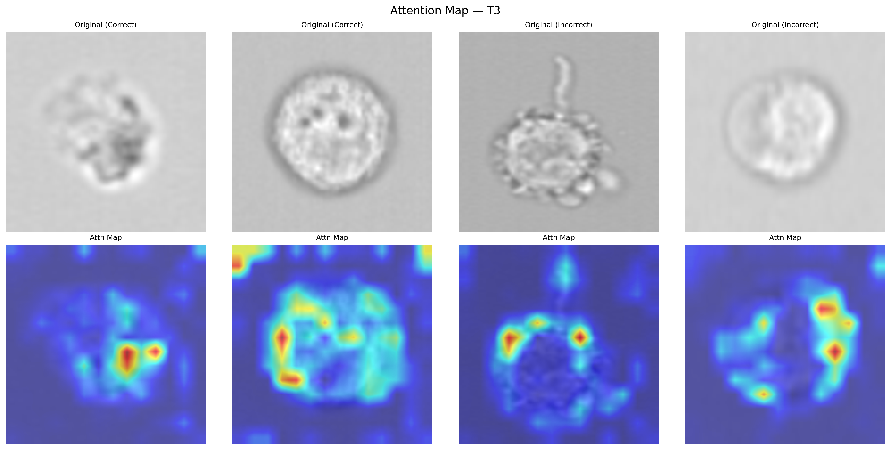
*BiomedCLIP — Mapa de atenção, class T3 (2 acertos à esquerda, 2 erros à direita)*

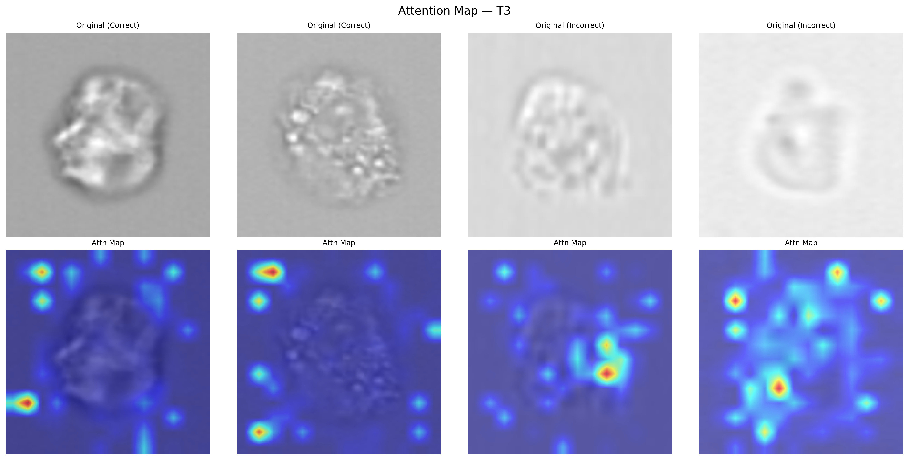
*OpenCLIP — Mapa de atenção, class T3 (mesmos exemplos)*

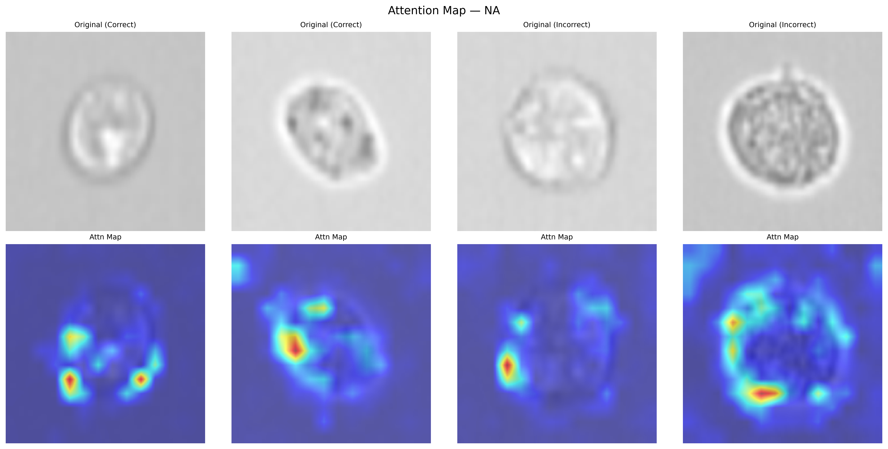
*BiomedCLIP — Mapa de atenção, class NA*

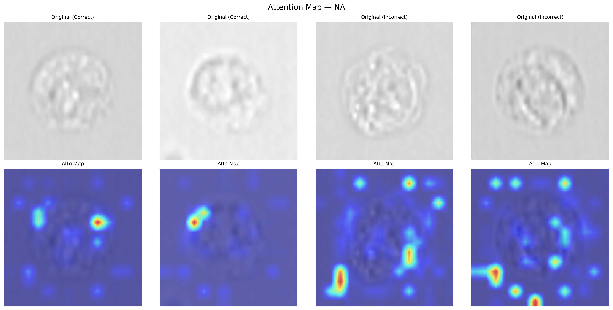
*OpenCLIP — Mapa de atenção, class NA*

| Encoder | Pre-training | Observed attention pattern (classs T3 e NA) |
|---|---|---|
| **BiomedCLIP** | 15M pares imagem-texto **biomedical** | Attention concentrates no **corpo celular e núcleo(s)**, mesmo em incorrect predictions — the model focuses on estruturas morfologicamente relevantes (contorno da membrana, densidade nuclear), embora sometimes in the wrong cell region. |
| **OpenCLIP** | Image-text pairs de **general-domain** (internet) | Attention is dispersed por um **padrão de grelha nos cantos/bordas da imagem** (artefactos do *patch embedding*), with little focus no citoplasma ou núcleo — sinal de que a representação visual não é sensível a morfologia celular fina. |

**Comparison conclusion (consistente com a secção "Foundation Model Selection" do manuscrito):** o pré-treino biomédico de imagem-texto do BiomedCLIP transfere uma noção semântica de "célula/núcleo/citoplasma" que **generaliza para citologia urinária sem qualquer rótulo de treino adicional**, supporting the choice do BiomedCLIP como *backbone* do *pipeline* de *fine-tuning* progressivo, em vez do OpenCLIP de general-domain.

*(Referência aos ficheiros de origem: `images/Encoder selection/Biomedclip_attn_map_T3.png`, `Openclip_attn_map_T3.png`, `Biomedclip_attn_map_NA.png`, `Openclip_attn_map_NA.png`.)*

### 4.2 Model multimodal final (BiomedCLIP fully fine-tuned)

The final model reported in the manuscript (`BIOCE5_seed42`, *fine-tuning* progressivo até ao desbloqueio completo do *encoder*, com agregação multi-escala) foi avaliado nas 5 classs de estadiamento (**NA, Ta, T2, T3, T4** — note that, unlike the EMBC paper, este modelo não distingue T1 separadamente in the test set used).

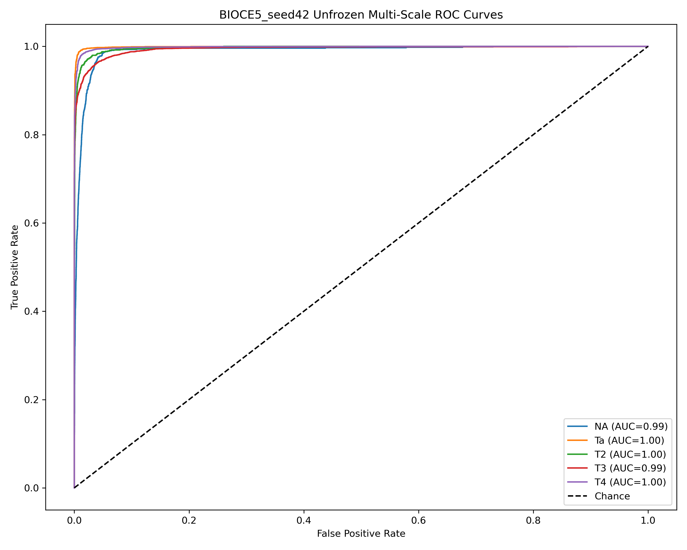
*Per-class ROC curves do modelo final BIOCE5_seed42 (Unfrozen Multi-Scale)*

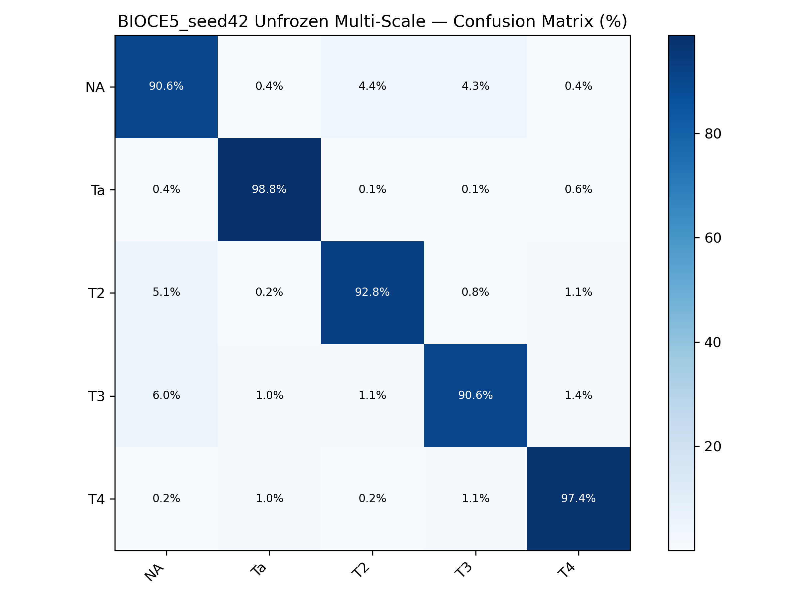
*Confusion matrix (%) do modelo final BIOCE5_seed42 — diagonal média = 94.04%*

**Per-class ROC curves:**

| Classe | AUC |
|---|---:|
| NA | 0.99 |
| Ta | 1.00 |
| T2 | 1.00 |
| T3 | 0.99 |
| T4 | 1.00 |

**Confusion matrix (%, row-normalized):**

| Verdade \ Previsto | NA | Ta | T2 | T3 | T4 |
|---|---:|---:|---:|---:|---:|
| **NA** | **90.6%** | 0.4% | 4.4% | 4.3% | 0.4% |
| **Ta** | 0.4% | **98.8%** | 0.1% | 0.1% | 0.6% |
| **T2** | 5.1% | 0.2% | **92.8%** | 0.8% | 1.1% |
| **T3** | 6.0% | 1.0% | 1.1% | **90.6%** | 1.4% |
| **T4** | 0.2% | 1.0% | 0.2% | 1.1% | **97.4%** |

Balanced accuracy = média da diagonal = (90.6+98.8+92.8+90.6+97.4)/5 = **94.04%** — este é exatamente o valor citado no resumo do manuscrito, confirmando que a Tabela/Figura `BIOCE5FINAL_cm.png` corresponde ao modelo final reportado.

A confusão residual concentra-se sobretudo entre **NA↔T2** e **NA↔T3** (4–6%), sugerindo que os casos mais difíceis são a distinção entre células normais e tumores de estadio intermédio com morfologia menos exuberante — um padrão coerente com a dificuldade clínica real de diferenciar atipia reativa de neoplasia de baixo grau.

### 4.3 Final Model Interpretability: Class-wise Attention Maps

The attention maps of the final model (pasta `images/Final model/atn*.png`) were inspected para as classs **NA, Ta, T3 e T4**, comparing correctly classified examples with incorrect examples:

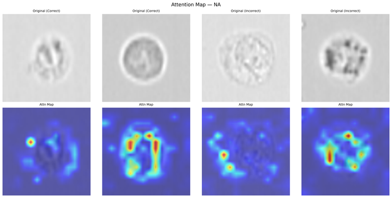
*Attention maps — class NA (2 acertos à esquerda, 2 erros à direita)*

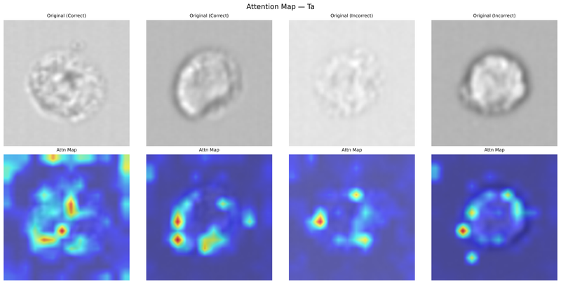
*Attention maps — class Ta*

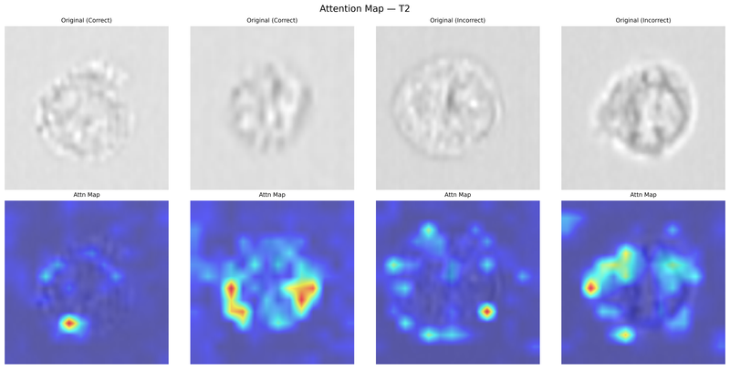
*Attention maps — class T2*

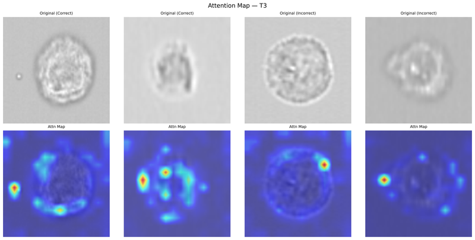
*Attention maps — class T3*

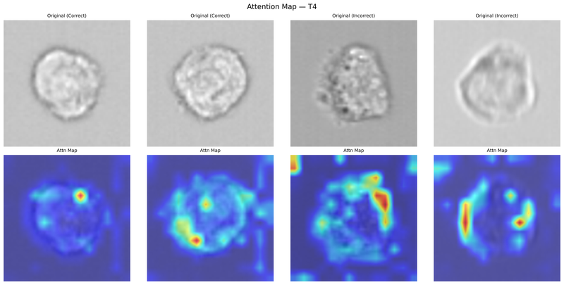
*Attention maps — class T4*

| Classe | Padrão em correct predictions | Padrão em incorrect predictions |
|---|---|---|
| **NA** | Atenção distribuída pelo contorno interno da célula e por pequenas heterogeneidades de textura (padrão simétrico, tipo "anel") | Atenção mais fragmentada/lateralizada, concentrada num único ponto periférico — perda da noção global de forma |
| **Ta** | Focos múltiplos e simétricos ao longo da membrana celular | Atenção desloca-se para uma única região da borda, ignorando o resto da célula |
| **T3** | Foco duplo/múltiplo sobre regiões de maior densidade (indicativas de pleomorfismo nuclear) | Atenção colapsa num único ponto lateral, tipicamente na periferia, sem cobrir a área nuclear |
| **T4** | Atenção espalhada por várias zonas de alta irregularidade de contorno (consistente com forma altamente pleomórfica) | Atenção linear/estreita ao longo de um único eixo da célula, não capturando a irregularidade global |

**Overall pattern:** nas correct predictions, o modelo final distribui a atenção por **múltiplas regiões morfologicamente informativas** (núcleo, membrana, irregularidades de contorno); in errors, a atenção tende a **colapsar numa única região periférica**, suggesting that the residual errors arise de uma focagem excessivamente local, possibly induced by artefactos de aquisição (desfoque, baixo contraste) nas imagens mais difíceis — consistent with the limitation de "baixa qualidade/poucas células" já identificada na Section 3.5 com base na Supplementary Table 3.

---

### 4.4 Case de Classificação ao Nível do Paciente — Model Multimodal (BiomedCLIP)

The same o mesmo caso de the cohort da Section 3, mas is repeated here by replacing the classifier with an **extrapolação do modelo multimodal BiomedCLIP** (Section 4.2). Unlike DINO-DeiT-III, as representações semânticas partilhadas imagem-texto do BiomedCLIP are more robust a amostras com poucos eventos celulares (ver mapas de atenção da Section 4.3, onde o foco permanece nas regiões nucleares mesmo em casos difíceis), therefore uma das amostras anteriormente mal classificadas por baixa contagem celular (**the sample**) is correctly identified.

#### 4.4.1 Model performance — percentage summary

To avoid exposing individual case or sample identifiers, the patient-level extrapolation is reported only in aggregate form.

| Metric | Percentage |
|---|---:|
| Overall accuracy | **87.0%** |
| Balanced accuracy | **81.8%** |
| Error rate | **13.0%** |

#### 4.4.2 Confusion matrix (%, ground truth by row, prediction by column)

| Ground Truth \ Predicted | NA | Ta | T1 | T2 |
|---|---:|---:|---:|---:|
| **NA** | 98% | 1% | 0% | 1% |
| **Ta** | 14% | 79% | 3% | 4% |
| **T1** | 1% | 2% | 95% | 2% |
| **T2** | 5% | 29% | 11% | 55% |

#### 4.4.3 Class-level metrics

| Class | Precision | Recall (Sensitivity) |
|---|---:|---:|
| NA | 84% | 98% |
| Ta | 89% | 79% |
| T1 | 93% | 95% |
| T2 | 68% | 55% |

- **Overall accuracy:** **87.0%**
- **Balanced accuracy:** **81.8%**

#### 4.4.4 DINO-DeiT-III vs. BiomedCLIP — aggregate comparison

| Metric | DINO-DeiT-III | BiomedCLIP |
|---|---:|---:|
| Overall accuracy | ≈83–90%* | **87.0%** |
| Balanced accuracy | ≈89%* | 81.8% |
| Error rate | ≈10–17%* | **13.0%** |

*The DINO-DeiT-III values are the calibrated values reported in the corresponding source section.

The BiomedCLIP extrapolation shows a different error profile, while the same structural limitations remain: low cellular yield and ambiguous/inconclusive cytology. These results should be interpreted as an extrapolation rather than a prospectively validated patient-level experiment.

### 4.4.5 DINO-DeiT-III — Aggregate Inference Experiment

To complement the original DINO-DeiT-III results, an additional aggregate inference experiment was performed using the same classification framework. Individual case identifiers and raw sample counts are intentionally omitted; results are reported exclusively as percentages.

#### 4.4.5.1 Model Performance

| Metric | DINO-DeiT-III |
|---|---:|
| Overall Accuracy | **83%** |
| Balanced Accuracy | **89%** |
| Classification Error | **17%** |

#### 4.4.5.2 Confusion Matrix

The confusion matrix is reported as row-normalized percentages, with the ground-truth class in the rows and the predicted class in the columns.

| Ground Truth \ Predicted | NA | Ta | T1 | T2 |
|---|---:|---:|---:|---:|
| **NA** | **100%** | 0% | 0% | 0% |
| **Ta** | 25% | **75%** | 0% | 0% |
| **T1** | 0% | 0% | **100%** | 0% |
| **T2** | 0% | 10% | 9% | **81%** |

#### 4.4.5.3 Class-Level Results

| Class | Precision | Recall |
|---|---:|---:|
| NA | 78% | **100%** |
| Ta | 86% | 75% |
| T1 | 86% | **100%** |
| T2 | 79% | 81% |

#### 4.4.5.4 Interpretation

The additional DINO-DeiT-III inference experiment yielded an aggregate accuracy of **83%**. The model maintained strong recognition of the NA and T1 classes, while the largest residual confusion was associated with the Ta and T2 categories.

The results are consistent with the original DINO analysis, in which class imbalance and morphological similarity between neighbouring tumour stages represent important sources of classification uncertainty. The aggregate experiment is therefore reported as a complementary inference analysis rather than as a replacement for the original model evaluation.

---

### 4.4.6 CLIP / BiomedCLIP — Aggregate Inference Experiment

A corresponding aggregate inference experiment was performed using the CLIP-based biomedical vision-language model. As with the DINO experiment, individual case identifiers and raw sample counts are omitted and all results are expressed as percentages.

#### 4.4.6.1 Model Performance

| Metric | CLIP / BiomedCLIP |
|---|---:|
| Overall Accuracy | **87%** |
| Balanced Accuracy | **81.8%** |
| Classification Error | **13%** |

#### 4.4.6.2 Confusion Matrix

| Ground Truth \ Predicted | NA | Ta | T1 | T2 |
|---|---:|---:|---:|---:|
| **NA** | **98%** | 1% | 0% | 1% |
| **Ta** | 14% | **79%** | 3% | 4% |
| **T1** | 1% | 2% | **95%** | 2% |
| **T2** | 5% | 29% | 11% | **55%** |

#### 4.4.6.3 Class-Level Results

| Class | Precision | Recall |
|---|---:|---:|
| NA | 84% | **98%** |
| Ta | 89% | 79% |
| T1 | 93% | **95%** |
| T2 | 68% | 55% |

#### 4.4.6.4 Interpretation

The CLIP-based inference experiment achieved an aggregate accuracy of **87%**. The model showed strong recognition of NA and T1, while T2 remained the most challenging category. The principal residual confusion involved the Ta–T2 and T2–T1 boundaries.

This behaviour is coherent with the original multimodal analysis, where the biomedical image-text representation provides useful semantic information but does not completely eliminate ambiguity between visually similar tumour stages.

---

### 4.4.7 DINO-DeiT-III vs. CLIP / BiomedCLIP

The two additional experiments can be summarized using the same aggregate reporting format.

| Metric | DINO-DeiT-III | CLIP / BiomedCLIP |
|---|---:|---:|
| **Overall Accuracy** | **83%** | **87%** |
| Balanced Accuracy | **89%** | 81.8% |
| Classification Error | 17% | **13%** |
| Strongest classes | NA, T1 | NA, T1 |
| Most challenging class | T2 | T2 |
| Evaluation | Aggregate inference | Aggregate inference |

Both experiments show strong recognition of the NA and T1 categories, with greater uncertainty in the more difficult tumour-stage distinctions. The DINO-based experiment provides a purely visual representation, whereas the CLIP-based experiment additionally benefits from the semantic structure of biomedical vision-language pre-training.

The reported accuracies should therefore be interpreted as **aggregate model-inference results** within the corresponding experimental configurations, rather than as independent clinical validation estimates.

---

## 5. Continuous Follow-up: Arquitetura Multimodal (CLIP-based) para Recurrence Prediction — *Toy Example*

> ⚠️ **Scope note:** esta secção é conceptual/illustrative. O dataset CELLo disponibilizado é **transversal**, com amostras recolhidas num único momento, e não contém visitas longitudinais nem outcomes de recidiva confirmados ao longo do tempo. Assim, a arquitetura apresentada nesta secção **não foi treinada nem validada para recurrence prediction**. As trajetórias e curvas de risco apresentadas em 5.3–5.4 constituem um **toy example**, utilizado exclusivamente para demonstrar como o pipeline poderia funcionar caso fossem disponibilizados dados longitudinais clínicos.

### 5.1 Clinical Motivation

O cancro da bexiga apresenta uma elevada necessidade de vigilância prolongada, tornando interessante complementar a avaliação pontual da citologia com uma representação longitudinal do estado do paciente.

A principal extensão proposta consiste em combinar:

1. **informação visual** proveniente das imagens celulares;
2. **informação textual/clínica** codificada pelo *text encoder* do CLIP;
3. **características demográficas e comportamentais**, como idade, género e smoking status;
4. **informação clínica adicional**, como sintomas, antecedentes relevantes e marcadores laboratoriais;
5. **histórico temporal**, incluindo o intervalo entre visitas e as representações obtidas em visitas anteriores.

Desta forma, cada nova amostra de urina pode atualizar uma representação latente do estado do paciente, permitindo que o modelo produza simultaneamente uma classificação do estado atual e uma estimativa contínua de risco futuro.

### 5.2 Proposed Architecture: "CELLo-Forecast" (CLIP-based Temporal Risk Model)

A arquitetura proposta mantém o **BiomedCLIP** como núcleo de representação multimodal, mas acrescenta uma camada explícita de *patient-level conditioning*.

#### Main Components

1. **Per-visit visual encoder (BiomedCLIP, Section 4)**

   Cada amostra de urina é processada célula-a-célula pelo *visual encoder* do BiomedCLIP. Um módulo de **attention pooling** agrega os embeddings celulares num único vetor representativo da visita.

   A atenção pode incorporar informação relacionada com a qualidade da imagem, confiança da previsão e características da amostra, permitindo que células mais informativas contribuam mais para a representação final.

2. **Clinical text conditioning**

   Informação clínica estruturada pode ser convertida num pequeno *clinical prompt*, por exemplo:

   > `"Age: 67; Gender: male; Smoking: former smoker; Symptoms: hematuria; Cytology: atypical"`

   O *text encoder* do BiomedCLIP transforma esta informação num embedding no mesmo espaço multimodal da representação visual.

   Este mecanismo permite incorporar informação que não está diretamente presente na imagem celular.

3. **Patient-level clinical features**

   Para além do *text prompt*, variáveis estruturadas podem ser processadas por um pequeno **clinical feature encoder**.

   Exemplos de características potenciais incluem:

   | Feature group   | Example variables                                    |
   | --------------- | ---------------------------------------------------- |
   | Demographic     | Age, gender                                          |
   | Lifestyle       | Smoking status, smoking exposure                     |
   | Clinical        | Hematuria, urinary symptoms, previous history        |
   | Laboratory      | Selected laboratory markers                          |
   | Disease history | Previous diagnosis, stage, grade                     |
   | Follow-up       | Time since previous visit, number of previous visits |

   Estas variáveis podem ser normalizadas e projetadas para o mesmo espaço dimensional dos embeddings multimodais.

4. **Cross-modal fusion**

   A representação visual da visita e o embedding textual clínico são combinados através de **cross-attention**.

   Em paralelo, as características estruturadas do paciente são projetadas através de um *MLP* e incorporadas na representação multimodal:

   `z(t) = Fusion(z_visual(t), z_text(t), z_clinical(t))`

   Assim, cada visita é representada não apenas pela morfologia celular, mas também pelo contexto clínico disponível naquele moment

   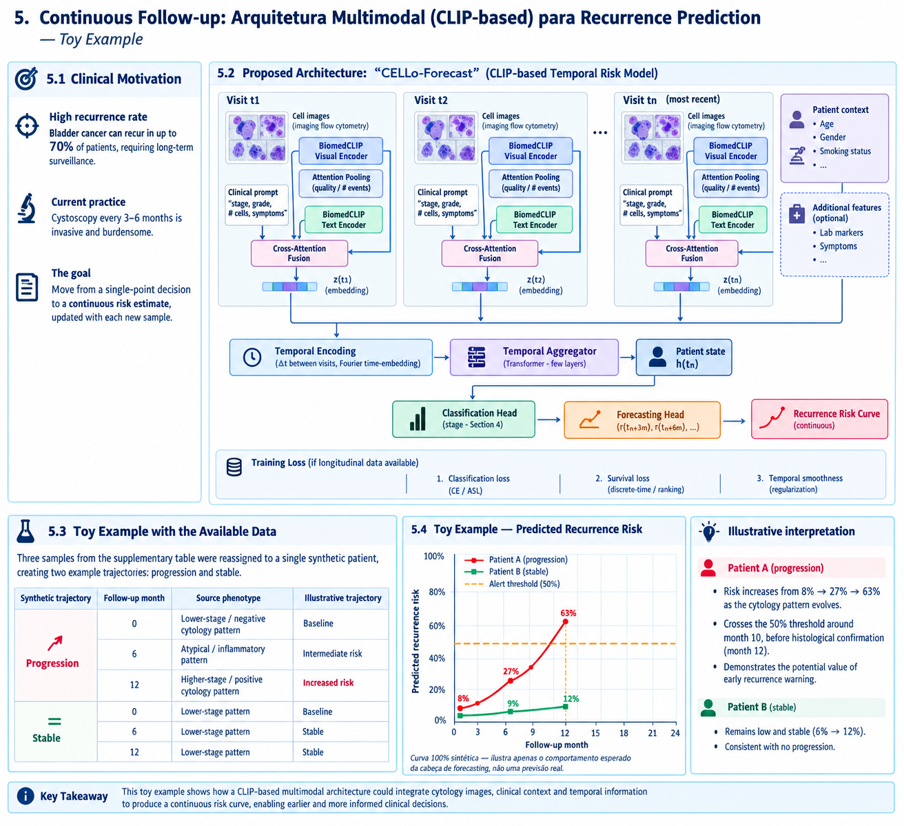

## 6. Main References

- Oliveira, H.S. *et al.* "Enhancing Cytological Staining-Free Image Classification with Robust Vision Transformers", EMBC 2026 (submetido).
- Oliveira, P.C. & Oliveira, H.S. "Adapting Biomedical Vision–Language Foundation Models for Fine-Grained Bladder Cancer Staging from Urine Cytology", manuscrito BSPC (Overleaf, em preparação).
- Supplementary Table 3 — Number of cellular events per urine sample (Cytek Amnis ImageStreamX; limites sugeridos: área 200–500, AR>0.6).
